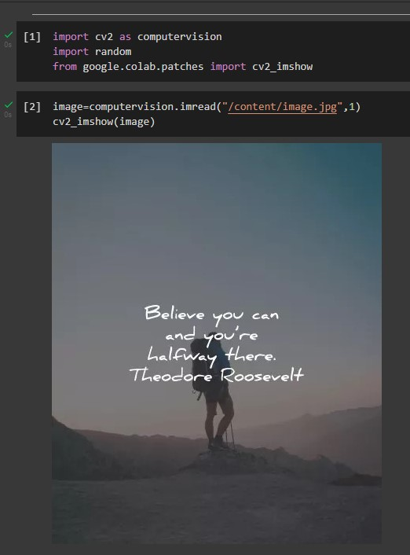
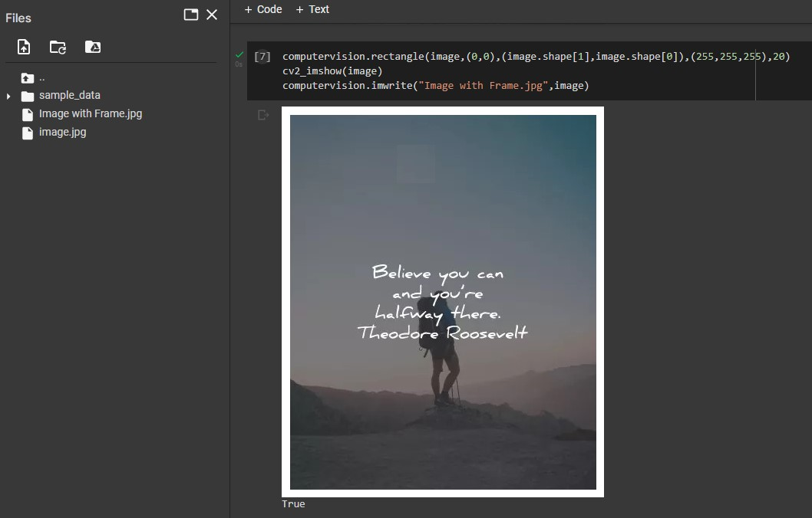
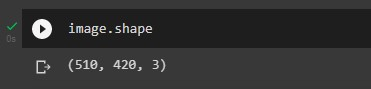
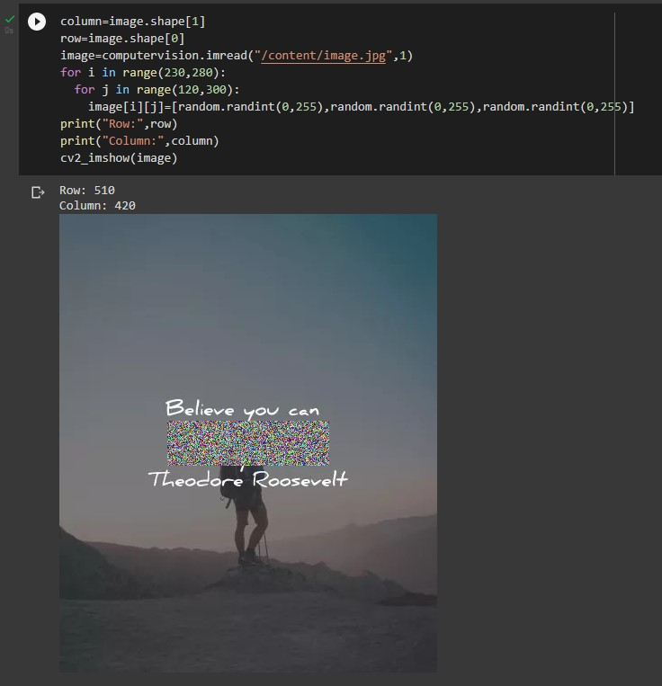
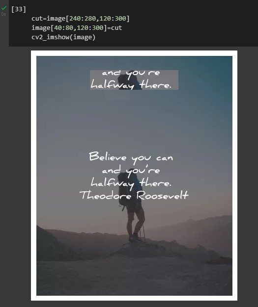

# Read and Write images using OpenCV

## Aim:
To write a python program using OpenCV to do the following image manipulations. 
i) Read and display the image
ii)Write the image
iii)Shape of the Image
iv)Access rows and columns
v)Cut and paste portion of image
## Software Required:
Google Colab or Jupyter Lab
## Algorithm:
### Step 1: 
Choose an image and save it as image.jpg
### Step 2:
Use imread(image, flags) to read the file.
### Step 3:
Use imshow(window_name, image) to display the image.
### Step 4:
Use imwrite(filename, image) to write the image.
### Step 5:
End the program and close the output image windows.

<br><br><br><br><br><br>
## Program:
#### Developed By: Marinto Richee
#### Register Number: 212220230031
```Python 
# To Read,display the image

import cv2 as computervision
from google.colab.patches import cv2_imshow
image=computervision.imread("/content/image.jpg",1)
cv2_imshow(image)

# To write the image

computervision.rectangle(image,(0,0),(image.shape[1],image.shape[0]),(255,255,255),20)
cv2_imshow(image)
computervision.imwrite("Image with Frame.jpg",image)

# Find the shape of the Image

image.shape

# To access rows and columns

column=image.shape[1]
row=image.shape[0]
image=computervision.imread("/content/image.jpg",1)
for i in range(230,280):
  for j in range(120,300):
    image[i][j]=[random.randint(0,255),random.randint(0,255),random.randint(0,255)]
print("Row:",row)
print("Column:",column)
cv2_imshow(image)

# To cut and paste portion of image

cut=image[240:280,120:300]
image[40:80,120:300]=cut
cv2_imshow(image)

```

<br><br><br>
## Output:
### i) Read and display the image


<br><br><br><br><br>
### ii)Write the image

### iii)Shape of the Image


<br><br><br><br><br><br><br><br><br><br><br><br><br><br>
### iv)Access rows and columns

### v)Cut and paste portion of image

## Result:
Thus the images are read, displayed, and written successfully using the python program.
