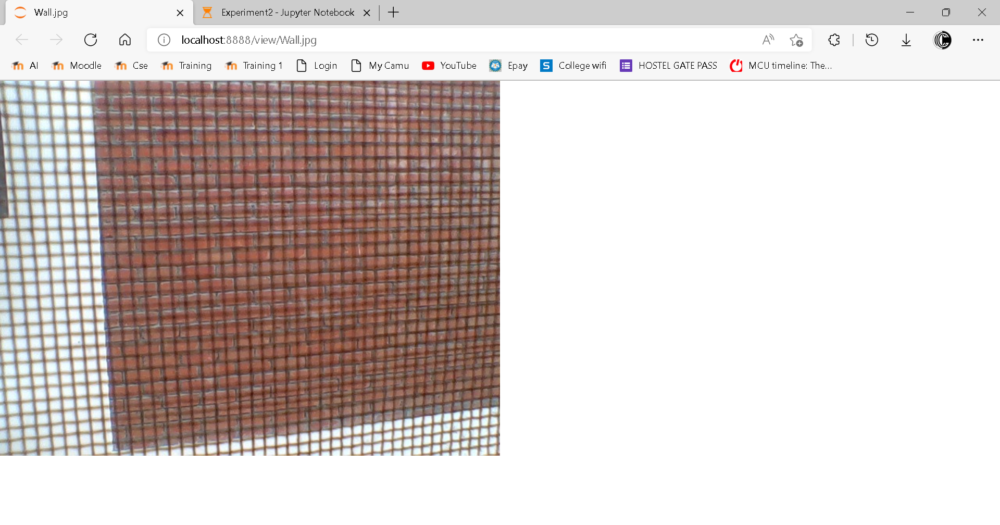
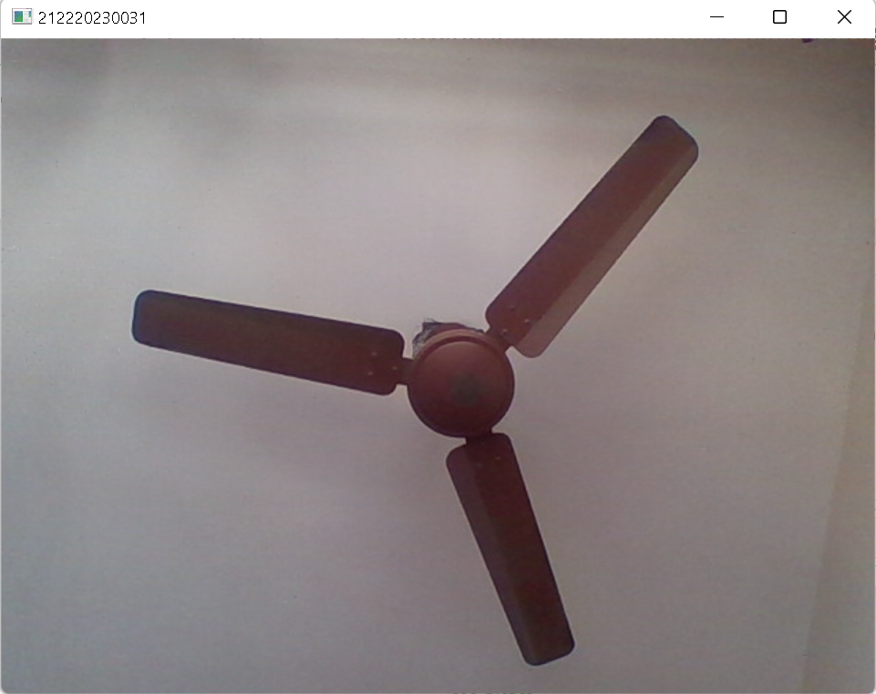
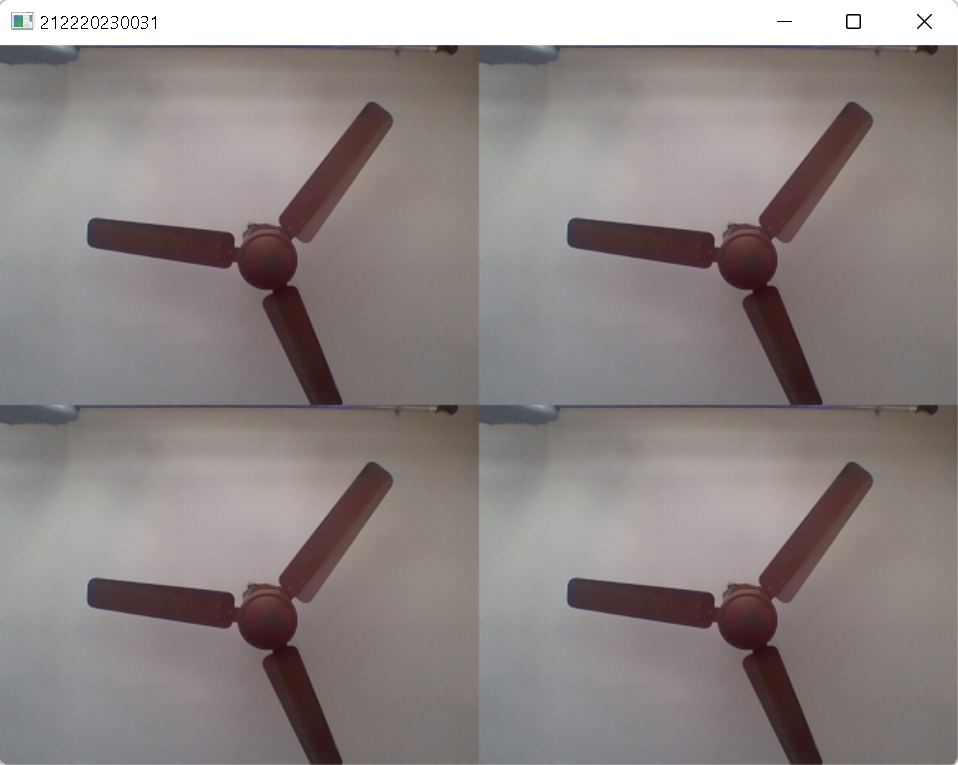
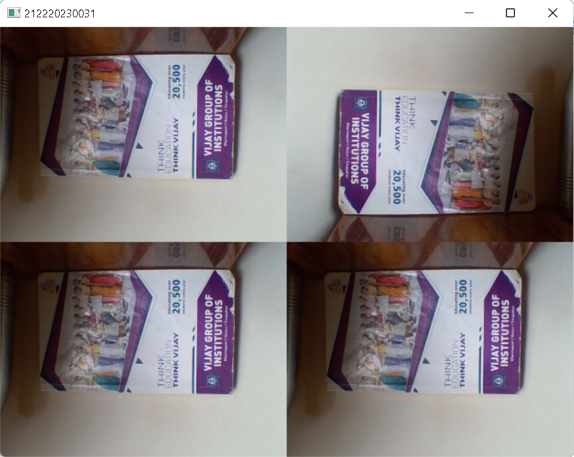

# Image Acquisition from Web Camera

## Aim:

To write a python program using OpenCV to capture the image from the web camera and do the following image manipulations.
<br/>i) Write the frame as JPG
<br/>ii) Display the video
<br/>iii) Display the video by resizing the window
<br/>iv) Rotate and display the video

## Software Required:

Anaconda - Python 3.7

## Algorithm:

### Step 1:
Use image=cv2.VideoCapture(0) to capture the frame using webcamera and use imwrite(filename, image) to write the image.
### Step 2:
To display the video use<br/>cv2.imshow(window_name, frame)<br/>&ensp;&ensp;&ensp;&ensp;&ensp;if cv2.waitKey(1) == ord('q')<br/>&ensp;&ensp;&ensp;&ensp;&ensp;&ensp;&ensp;break
### Step 3:
To display the video by resizing the window size use cv2.resize(src, dsize, fx, fy, interpolation)
### Step 4:
To rotate and display the video use cv2.cv2.rotate( src, rotateCode[, dst] )
<br><br>
### Step 5:
End the program and close the output image windows.

## Program:
#### Developed By: Marinto Richee
#### Register Number: 212220230031
```Python 

## i) Write the frame as JPG file

import cv2
webcam = cv2.VideoCapture(0)
while(True):
    ret,frame = webcam.read()
    cv2.imwrite("Wall.jpg",frame)
    result = False
image.release()
cv2.destroyAllWindows()

## ii) Display the video

import cv2
Videocap=cv2.VideoCapture(0)
while True:
    ret,frame=Videocap.read()
    cv2.imshow('212220230031', frame)
    if cv2.waitKey(1) == ord('q'):
        break
Videocap.release()
cv2.destroyAllWindows()

## iii) Display the video by resizing the window

import cv2
import numpy as np
Videoresize=cv2.VideoCapture(0)
while True:
    ret,frame=Videoresize.read()
    width=frame.shape[1]
    height=frame.shape[0]
    image=np.zeros(frame.shape,np.uint8)
    smaller_frame=cv2.resize(frame,(0,0),fx=0.5,fy=0.5)
    image[:height//2, :width//2] =smaller_frame
    image[:height//2,width//2:]=smaller_frame
    image[height//2:,width//2:]=smaller_frame
    image[height//2:,:width//2]=smaller_frame
    cv2.imshow('212220230031', image)
    if cv2.waitKey(1) == ord('q'):
        break
Videoresize.release()
cv2.destroyAllWindows()

## iv) Rotate and display the video

import cv2
import numpy as np
Videorotate=cv2.VideoCapture(0)
while True:
    ret,frame=Videorotate.read()
    width=frame.shape[1]
    height=frame.shape[0]
    image=np.zeros(frame.shape,np.uint8)
    smaller_frame=cv2.resize(frame,(0,0),fx=0.5,fy=0.5)
    image[:height//2, :width//2] =cv2.rotate(smaller_frame,cv2.cv2.ROTATE_180)
    image[:height//2,width//2:]=cv2.rotate(smaller_frame,cv2.cv2.ROTATE_180)
    image[height//2:,width//2:]=smaller_frame
    image[height//2:,:width//2]=smaller_frame
    cv2.imshow('212220230031', image)
    if cv2.waitKey(1) == ord('q'):
        break
Videorotate.release()
cv2.destroyAllWindows()

```
<br><br><br><br><br><br><br><br><br><br><br><br><br><br><br>
## Output:

### i) Write the frame as JPG image


<br><br><br><br><br><br><br><br><br><br><br><br><br><br><br><br>

### ii) Display the video


<br><br><br><br><br><br><br><br><br><br><br><br>
### iii) Display the video by resizing the window


<br><br><br><br><br><br><br><br><br><br><br>
### iv) Rotate and display the video


## Result:
Thus, the image is accessed from webcamera and displayed using openCV.
